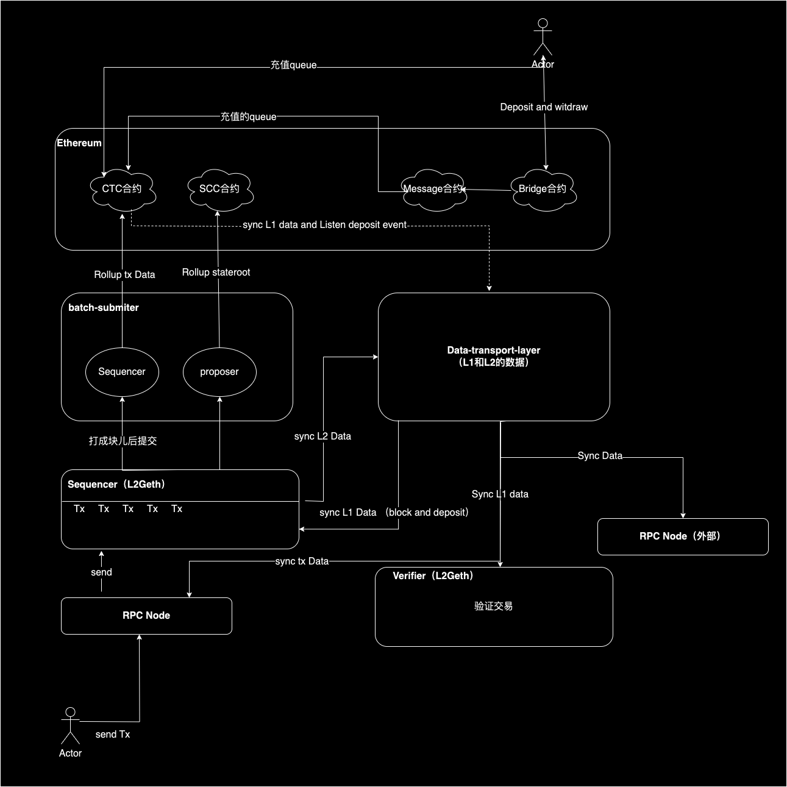

# ovm

* **CTC（Canonical Transaction Chain）合约**：主要负责管理 Layer 2 上所有交易的顺序和记录。它维护一个交易链，将所有从 Layer 2 发送到 Layer 1 的交易聚合在一起。管理和记录了所有 Layer 2 的交易。
* **SCC（State Commitment Chain）合约**：负责管理 Layer 2 的状态根（State Root），即 Layer 2 上所有账户和智能合约的状态快照。它验证并记录这些状态更新，以确保 Layer 2 的状态与 Layer 1 的一致性。管理和验证了这些交易执行后的状态根。
* **信使合约（Message Contract）**：主要用于在不同的链之间传递消息。消息可以是状态更新、事件通知、函数调用等，这些消息不一定涉及资产的转移。
* **桥合约（Bridge Contract）**： 桥合约主要用于在不同的链之间进行资产的转移，确保跨链资产的安全性和一致性。
* **batch-submiter**: 主要用于将 L2 网络上的交易数据批量提交到 L1（Layer 1）上
* **sequencer**：`sequencer`（排序者）是一个负责管理交易顺序、打包和提交交易到主链的角色
* **proposer**：提交交易状态（stateRoot）到ET H 
* Geth：使用go编写的以太坊核心代码 

 ## 说明

* sequencer：交易定序器，执行交易
* batch-submitter：里面有两个角色，一个叫sequencer，一个叫proposer，sequencer负责提交交易数据到CTC合约，proposer负责提交交易stateroot到SCC合约
* CTC合约：存储交易数据的合约
* SCC合约：存储交易状态的合约
* data-transport-layer：数据中转服务，用于同步L1区块和充值数据，L1 Rollup tx data；
* verifier：交易验证，在OVM稳定版本代码，主要用于验证区块的stateroot
* bridge和message：桥和信使合约，承载充值和提现的功能

sequencer、Verifer和RPC使用的代码都是l2Geth，l2geth是geth的fork版本。ovm在geth中增加了rollup的相关代码，基于OVM的代码是EVM兼容性的链。