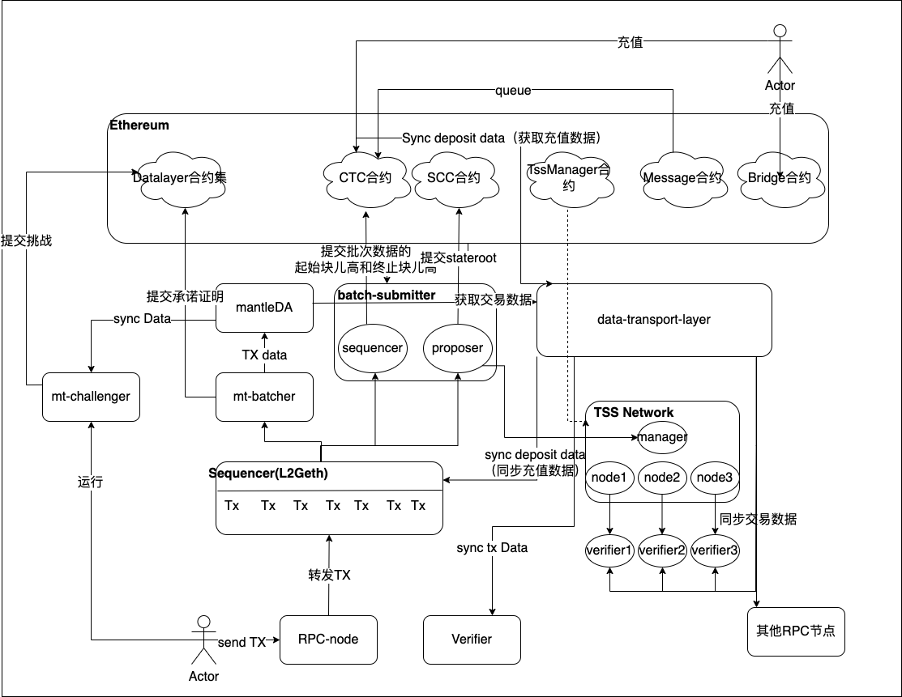
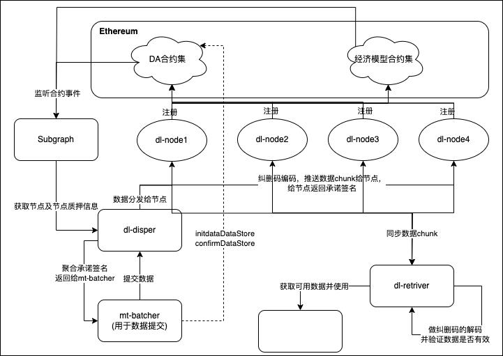

# Mantle_v1

https://github.com/mantlenetworkio/mantle

用户发起交易到RPC节点，sequencer会将交易数据排序后，发送给mt-batcher进行数据压缩。数据压缩后会发送到MantleDA中，并返回承诺给mt-batcher。mt-batcher再将数据提交到Datalayer合约集中去。

batch-submitter中的sequencer会将起始块儿和终止块儿提交到CTC合约中。batch-submitter中的proposer以起始块儿和终止块儿的游标提交stateroot。提交stateroot需要整个TSS网络进行验证。

data-transport-layer从CTC合约中同步充值交易，并从mantleDA中同步交易数据。同步完成的数据供给Verifier和sequencer使用。  

sequencer(l2Geth)使用同步的充值交易组合到交易数据中。

mt-challenger通过DA的数据进行作恶检测，当发现作恶时将信息提交到Datalayer合约集中。

-----

* sequencer：交易定序器，执行交易
* batch-submitter：里面有两个角色，一个叫sequencer，一个叫proposer，sequencer负责提交每一批次的start-block和end-block到CTC合约，proposer负责提交交易stateroot到SCC合约
* CTC合约：只存储区块游标
* SCC合约：存储交易状态的合约
* data-transport-layer：数据中转服务，用于同步L1充值数据，MantleDA tx data；同步L2的交易数据
* verifier：交易验证，在OVM稳定版本代码，主要用于验证区块的stateroot
* bridge和message：桥和信使合约，承载充值和提现的功能
* Tss网络：每次提交stateRoot前对stateRoot做验证
* MantleDA 存储交易数据
* Mt-batcher：交易数据提交者，将交易数据提交到mantleDA中
* Mt-challenger：数据挑战者，负责MantleDA数据挑战，保证数据的可用性
* TssManager合约：管理整个Tss，节点注册、退出、奖励与惩罚
* Datalayer合约集合：管理MantleDa网络，包含节点注册、退出、奖励与惩罚

## MantleDA

datalayer即上图中的DA合约集，eigenDA即上图中的经济模型合约集。

MantleDA基于eigenDA改造，主要用于存储数据。MantleDA依然继承以太坊L1的去中心化和安全性。MantleDA在以太坊一层部署了datalayer和eigenlayer。datalayer负责数据相关合约，eigenlayer用于质押的经济模型。所有的dl-node都需要往datalayer和eigenlayer进行注册。当dl-node注册成operator后都可以接受质押者进行质押。质押者将权益委托给dl-node。Subgraph负责监听节点的注册事件，还有initdataDataStore、confirmDataStore的事件。整个网络ready后，dl-disper从Subgraph获取节点信息和质押量，根据获得信息算出数据的分片，并将数据chunk发送给各个dl-node节点。dl-node收到数据后会返回数据的承诺签名。承诺签名会被dl-disper聚合起来，聚合签名会被mt-batcher提交到datalayer合约中。提交需要两步，initdataDataStore和confirmDataStore，提交后数据会变得有效。verifier会去从dl-retriver请求数据，dl-retriver从Subgraph中获取各个节点信息，拿到节点信息后从各个dl-node中请求对应chunk。dl-retriver根据chunk进行纠删码的逆向编码，恢复出data，verifier验证数据后返回data。

**MantleDA 基于 eigenDA 改造的文本描述：**

MantleDA 是一个基于 eigenDA 改造的系统，主要用于存储数据，同时继承了以太坊 L1 的去中心化和安全性。在以太坊的一层中，MantleDA 部署了两个关键组件：`datalayer` 和 `eigenlayer`。其中，`datalayer` 负责处理与数据相关的合约，而 `eigenlayer` 负责质押的经济模型。

所有的 `dl-node` 都需要分别在 `datalayer` 和 `eigenlayer` 进行注册。成为 `operator` 的 `dl-node` 后，节点可以接收质押者的质押，质押者则将权益委托给这些节点。

`Subgraph` 在系统中起着监听作用，负责监听节点注册事件以及与数据相关的 `initdataDataStore` 和 `confirmDataStore` 事件。当整个网络准备就绪时，`dl-disper` 会从 `Subgraph` 获取各个节点的相关信息（包括节点数量和质押量）。`dl-disper` 基于这些信息计算数据的分片，并将数据块（chunk）发送到相应的 `dl-node`。

每个 `dl-node` 在接收到数据块后，会返回一个数据承诺签名（commitment signature）。`dl-disper` 收集所有节点的承诺签名，并将它们聚合成一个聚合签名（aggregate signature）。该聚合签名由 `mt-batcher` 提交到 `datalayer` 合约中，并通过 `initdataDataStore` 和 `confirmDataStore` 两个步骤完成提交，数据随后变得有效。

验证者（verifier）通过 `dl-retriver` 请求数据。`dl-retriver` 会首先从 `Subgraph` 获取节点信息，然后从每个 `dl-node` 中获取对应的 `chunk`。`dl-retriver` 基于收到的 `chunk` 进行纠删码的逆向编码，恢复出完整的原始数据。最终，验证者验证数据的完整性并返回数据。

这种架构不仅确保了数据存储的安全性和高效性，还结合了以太坊的去中心化特点，增强了系统的容错能力与性能。

## Mantle v1 Rollup 源码解读

上图中存在三个Rollup，分别是交易Rollup、游标Rollup、stateRoot Rollup。

mt-batcher主要是用于将交易数据Rollup到mantleDA。suquencer主要是把startblock和endblock游标Rollup到CTC合约。proposer是将stateRoot rollUp到Scc合约。数据之间的Rollup是有前后关系的。假设之前已经提交到第10个块儿，mt-batcher将11-20个block提交到mantleDA， 此时endblock为20。从CTC取上次Rollup的块儿为起始块儿为10，从BVM_Eigen DataLayerchain取当前rollup完成的块儿20为endblock，suquencer将此时的startBlock和endBlock及时间戳提交到CTC合约中。scc合约基于suquencer提交后的数据为基础，此时的endblock为20，以上次proposer的提交到Scc合约结尾10为startblock，proposer将stateRoot提交到Scc合约中。

*  mt-batcher: 把交易数据 rollup 到 mantleDA, rollup 的交易数据里面含有 startBlock 和 endBlock

* batch-submitter里面的seqeuencer是以MantleDA的最新的区块做为endBlock, CTC合约里面的上次rollup blockNumber 做为startBlock，仅仅 rollup 区块号和区块时间戳，不再 rollup 交易数据。

* batch-submitter里面的proposer的rollup stateroot,以CTC的最新的区块做为endBlock, sCC合约里面的上 次 rollup blockNumber 做为 startBlock, 取到对应的这批 stateroot 之后， rollup 到 SCc 合约。

  顺序：必须要先 rollup 数据，确保数据的有效性之后，再 rollup stateroot,防止作恶或者意外的时候大面积的区块回滚。

##  BVM_EigenDataLayrChain 源码解读

##  mt-batcher 源码解读

## CTC合约源码解读

## SCC 合约源码解读

## CTC 合约源码解读

##  batch-submitter sequencer 源码解读

##  batch-submitter proposer 源码解读

