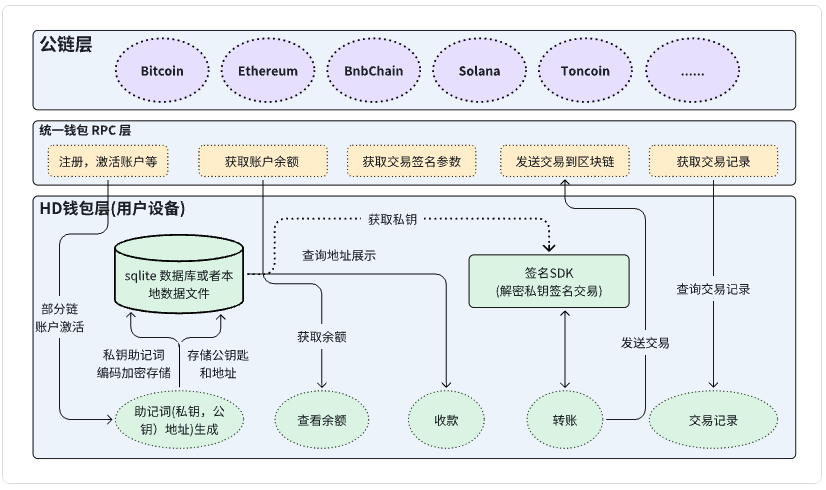

# 01. 钱包的分类

## 去中心化钱包

也称为**非托管钱包**，是指用户完全掌控自己资产和私钥的一种加密货币钱包，去中心化钱包比较出名的有 Tp，ImToken，MetaMask 等。与中心化钱包不同，去中心化钱包不依赖于第三方平台来管理用户的资金或私钥。用户对自己的私钥拥有完全的控制权，这意味着他们独立负责管理和保护自己的资产。

## 中心化钱包

交易所使用的钱包一般都称为中心化钱包，原因是交易所钱包私钥一般管理在中心化服务器上，不同的交易所的私钥管理方式也不一样。

### 常见的功能

- 批量地址生成
- 充值
- 提现
- 归集
- 热转冷
- 冷转热
- 链路风控

### 私钥的保存方式

1. 加密保存到数据库文件

   私钥通过DES加密后存储到数据库中。
2. KMS管理密钥

   使用KMS环境保存密钥，这种方式和加密后保存到数据库文件中类似。都会获得解密后到私钥，有非常高的安全风险。
3. 使用tee环境

   Tee 环境虽然是一个安全的执行环境，但是私钥也是加密之后存储在这个环境的数据库或者文件里面，每次签名也要在这个环境中解密私钥进行签名，私钥暴露的风险也很大。团队成员想拿到私钥也很容易，只需要签名前传人私钥是打一个日志就行。
4. cloadHSM 或者多节点备份的小型签名机

   私钥不会离开设备，需要签名的时候，传入待签名的报文，cloadHSM 或者小型签名机签名结束之后返回签名报文，然后整理签名交易报文发送到区块链网络。

## 硬件钱包

## 多签钱包

多签钱包是一种要求多个授权方共同签署交易才能完成的机制。它并不是基于私钥的分片，而是简单地要求多个独立的密钥参与到交易的签名中。举例来说，3-of-5 的多签钱包意味着有 5 个不同的私钥持有人，至少需要 3 个来共同签署交易才能进行资金转移。

### 工作机制

* 每个参与者都有自己的完整私钥。
* 交易发送时，多个参与者必须共同签署交易，每个签名都通过验证后交易才会被执行。

### 优势

* 简单易理解，已被多种区块链平台广泛支持。
* 适用于团队管理资金或对安全性有较高要求的场景。
* 没有复杂的密码学操作，且支持更灵活的结构（例如 2-of-3 或 3-of-5）。

### 缺点

* 需要每个签名者都参与交易的签署过程，可能在参与者众多时导致效率较低。
* 如果私钥被泄露或某些签名者失去访问权限，资金可能面临风险。

## MPC托管钱包

方计算是一种密码学协议，允许多个参与者在不泄露各自私有信息的情况下，联合计算某个函数的结果。在钱包场景中，这意味着多个参与方可以共同签署交易，但每个参与方都不会泄露自己的私钥片段。整个签名过程是分布式的，任何单个方都无法得到完整的私钥或控制权。**无需恢复完整的私钥**。

### 工作机制

* 每个参与者持有私钥的一部分片段，但没有人能单独恢复完整的私钥。
* 交易时，各方参与协作计算生成交易签名，但没有任何一方暴露其私钥片段。

### 优势

* 极高的安全性，因为私钥永远不会被完整地重建。
* 即便某些参与者失去控制或被攻击，其他参与者仍然可以协作处理交易，保持系统的去中心化和分散化。

### 缺点

* 实现较为复杂，涉及更多的密码学知识和通信协议。
* 在交易签名过程中存在额外的计算开销。

## 门限共享算法钱包

门限共享是一种将秘密（如私钥）分割成若干片段的方法，只有当收集到一定数量（门限数）的片段时，才能恢复完整的秘密。例如，将一个私钥分割成 5 份，设定 3 份为门限，则至少需要 3 个人的私钥片段才能恢复出完整的私钥进行签名。

### 工作机制

* 私钥被分割为若干片段，保存在不同的参与者手中。
* 当需要签名交易时，门限数量的片段被收集并用来重建完整的私钥，进而对交易进行签名。

### 机制

* 相对简单的实现，易于部署。
* 能够控制多少片段（参与者）可以恢复私钥，提供一定的灵活性。

### 缺点

* 恢复完整私钥的过程可能带来安全隐患。
* 如果攻击者获得了门限数量的片段，他们可以直接重建私钥，导致私钥失窃。

## EVM链AA钱包

以太坊虚拟机（EVM）兼容链上使用的一种基于账户抽象（Account Abstraction, AA）的钱包。AA 是一种新的钱包和账户设计概念，旨在提高钱包的灵活性、用户体验和安全性。传统上，以太坊钱包使用的是基于外部拥有账户（EOA）的模型，而 AA 提供了一种新的方式来管理账户和执行交易。

## 社交恢复钱包

存在人为安全风险，很少使用。

