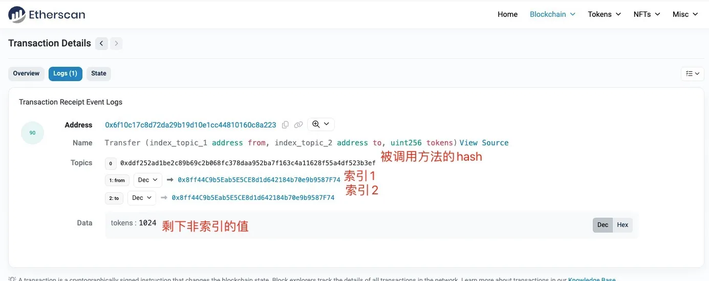

# 重点语法
## constant与immutable
### constant
* 定义：constant 变量必须在声明时赋值，值在合约的整个生命周期内保持不变。
* 适用场景：当你确定变量的值在合约编译时就已经固定，并且不会在运行时改变时使用 constant。
* 特点：编译器会直接将 constant 变量的值替换到代码中，类似于在编译时插入硬编码的常量。它只适用于简单的数值、布尔值、字符串等不涉及复杂运算的常量。
* 案例：
```solidity
uint256 public constant MAX_SUPPLY = 1000000;
```

### immutable
* 定义：immutable 变量可以在构造函数中赋值，一旦合约部署完成，这个值就不能再更改。
* 适用场景：当变量的值在部署时才能确定，或者需要动态地在构造函数中进行赋值，但之后不可修改时使用 immutable。
* 特点：immutable 变量在合约部署时计算并存储，但在运行时也不能修改。由于是不可变的，因此相对于普通变量存储成本更低。适合那些在合约部署时确定，但在编译时不确定的值。
```solidity
address public immutable owner;

constructor() {
    owner = msg.sender; // 部署合约时设置 owner 为合约的部署者
}
```

### 总结
* constant：用于在编译时就能确定的常量，比如数学常数、特定的最大值等。
* immutable：用于在合约构造时确定的常量，比如合约部署者地址、动态计算的参数等。

```solidity
// SPDX-License-Identifier: GPL-3.0

pragma solidity >=0.8.2 <0.9.0;


contract ConstantAndImmutableContract {
    uint256 public constant MAX_SUPPLY = 1000000;
    address public immutable owner;


    constructor() {
        owner = msg.sender;
    }
}
```

## modifier
modifier 是一种修饰符，用来修饰函数，可以在函数执行前或执行后插入一些逻辑条件。Modifiers 的主要作用是控制函数的访问权限，添加条件限制，以及避免重复代码。 

### Modifier 的作用
* 控制访问权限：常用于限制函数的访问权限，比如只有合约的所有者（owner）或特定的角色才能调用某些敏感操作。
* 检查前置条件：可以用来检查特定条件是否满足，如验证函数的输入或检查状态变量。
* 避免重复代码：可以将一些常用的检查或设置代码封装在 modifier 中，使代码更加简洁和易维护。

### 语法
一个 modifier 是通过 modifier 关键字定义的，通常会包含一段代码逻辑。在函数执行前，modifier 中的逻辑会先执行。
```solidity
// SPDX-License-Identifier: GPL-3.0

pragma solidity >=0.8.2 <0.9.0;


contract ConstantAndImmutableContract {
    address public owner;

    // 只有所有者有权限修改
    modifier onlyOwner() {
        require(msg.sender == owner, "Not the contract owner");
        _; // 表示函数主体的执行位置
    }

    constructor() {
        owner = msg.sender;
    }

    function changeOwner(address newOwner) public onlyOwner {
        owner = newOwner;
    }
}
```

### `_`的作用
在 modifier 中，_ 是一个占位符，表示函数主体的执行位置。当一个函数使用 modifier 时，_ 将被替换为函数主体的代码。例如，在 onlyOwner 的例子中，require 语句会在 changeOwner 函数执行前检查调用者是否为 owner。

### 常见使用
1. 访问控制（onlyOwner）

常用于限制只有合约的所有者才能调用该函数。
```solidity
modifier onlyOwner() {
    require(msg.sender == owner, "Not the owner");
    _;
}
```
2. 函数调用防重入（nonReentrant）

防止重入攻击，尤其是在调用外部合约时使用。
```solidity
bool private locked;

modifier nonReentrant() {
    require(!locked, "No re-entrancy");
    locked = true;
    _;
    locked = false;
}
```
3. 条件验证（onlyWhenActive）

例如，限制只有当合约处于激活状态时，某些函数才能被调用。
```solidity
bool public isActive = true;

modifier onlyWhenActive() {
    require(isActive, "Contract is not active");
    _;
}
```

4. 参数限制（如onlyAfter）

用于检查参数是否满足某些条件，例如只有在特定时间后才能执行。
```solidity
uint256 public startTime;

modifier onlyAfter(uint256 _time) {
    require(block.timestamp >= _time, "Function cannot be called yet");
    _;
}

```

5. 多重 modifier 的使用

一个函数可以使用多个 modifier，各个 modifier 会按照顺序依次执行
```solidity
function transferOwnership(address newOwner) public onlyOwner onlyWhenActive {
    owner = newOwner;
}

```

## 事件和浏览器中对应关系
```solidity
// SPDX-License-Identifier: GPL-3.0

pragma solidity >=0.8.2 <0.9.0;


contract Name {
    // 定义_balances映射变量，记录每个地址的持币数量
    mapping(address=>uint256) public _balance;

    // 定义Transfer event，记录transfer交易的转账地址，接收地址和转账数量
    event Transfer(address indexed from, address indexed to,uint256 amount);

    // 定义_transfer函数，执行转账逻辑
    function _transfer(address from, address to, uint256 amount) external {
        // 触发事件
        emit Transfer(from, to,amount);
    }
} 

```


## 修饰符号

### 访问控制修饰符

| 修饰符     | 作用                                                         |
| ---------- | ------------------------------------------------------------ |
| `public`   | 可以被合约内外部访问。修饰函数时，允许在合约内和外部账户、其他合约中调用；修饰状态变量时，允许合约内部和外部读取。 |
| `external` | 只能从合约外部调用（即外部账户或其他合约）。适用于只能在合约外调用的函数，以节省 gas 成本。 |
| `internal` | 只能在当前合约和派生合约中访问。修饰函数或状态变量，适用于继承链中的合约访问，但无法被外部合约或账户访问。 |
| `private`  | 只能在当前合约内部访问。即使是派生合约也无法访问，适用于仅对当前合约有意义的函数和状态变量。 |

### 函数类型修饰符

| 修饰符    | 作用                                                         |
| --------- | ------------------------------------------------------------ |
| `view`    | 表示函数不会修改合约的状态变量，但可以读取状态。允许调用其他 `view` 或 `pure` 函数，不允许发送 ETH。 |
| `pure`    | 表示函数既不读取也不修改合约状态。通常用于执行纯计算任务的函数，不能访问或修改合约的状态变量。 |
| `payable` | 表示函数可以接收 ETH。仅适用于接受 ETH 支付的函数，可读取状态变量并调用其他 `payable` 函数。 |

### 继承和重写修饰符

| 修饰符     | 作用                                                         |
| ---------- | ------------------------------------------------------------ |
| `virtual`  | 用于声明可以在派生合约中重写的“虚函数”。可以仅声明不实现具体逻辑，派生合约可用 `override` 来实现或重写。 |
| `override` | 用于重写父合约中的虚函数，必须与 `virtual` 函数配合使用，标识函数在子合约中提供了新的实现。 |

## 函数重写

函数重写指的是在派生合约（子合约）中重新定义父合约中已存在的虚函数（virtual function）。在 Solidity 中，通过在派生合约中使用 override 关键字来标识要重写的函数。

重写可以改变的内容

* **函数的实现（函数体）**：可以改变函数的逻辑，在 `Derived` 合约中 `getValue` 函数返回了 `20`，而不是 `Base` 合约中的 `10`。

* **增加新的修饰符**：可以添加额外的修饰符，比如 `view`、`payable` 等，但要确保修饰符不会违背基类的要求。例如，不能将一个 `view` 函数改为非 `view` 函数，因为它会破坏只读性。

```solidity
// SPDX-License-Identifier: GPL-3.0

pragma solidity >=0.8.2 <0.9.0;


contract Base {
    function getValue() public virtual  returns (uint256) {
        return 10;
    }
}

contract Derived is Base {
    // 非必须重写，不重写使用基层而来的方法
    function getValue() public virtual override returns (uint256) {
        return  20;
    }
}
```

## 函数重载

函数重载指的是在同一个合约中定义多个具有相同函数名但不同参数列表的函数。Solidity 支持函数重载，根据参数的类型和数量来区分不同的函数定义。

```solidity
// SPDX-License-Identifier: GPL-3.0

pragma solidity >=0.7.0 <0.9.0;


contract OverloadExample {
    function foo(uint256 _value) public pure returns (uint256) {
        return _value;
    }

    function foo(uint256 _val1, uint256 _val2) public pure returns (uint256) {
        return _val1 + _val2;
    }

        function foo(uint256 _val1, uint256 _val2, uint256 _val3) public pure returns (uint256) {
        return _val1 + _val2 + _val3;
    }
}
```

## 函数选择器

Solidity 中的函数选择器（Function Selector）是用来唯一标识函数签名的哈希值，它通常与函数调用和 ABI 编码相关联。在 Solidity 中，每个函数都有一个对应的函数选择器，用来标识函数的名称和参数类型，以便在合约内部和外部进行函数调用时进行唯一识别。

**函数选择器的计算方法**

- **ABI 编码**：将函数的名称和参数类型进行 ABI 编码。ABI 编码是一种规范化的字节序列，用于描述函数调用或合约间通信的参数和返回值。
- **计算哈希**：对 ABI 编码的结果应用 keccak256 哈希算法。Solidity 使用的函数选择器是这个哈希值的前 4 个字节（32位）。

```solidity
// SPDX-License-Identifier: GPL-3.0

pragma solidity >=0.7.0 <0.9.0;


contract ExampleContract {
    uint256 public value;

    function setValue(uint256 _value) public {
        value = _value;
    }
}

contract CallerContract {
    ExampleContract public exampleContract;

    constructor(address _exampleContract) {
        exampleContract = ExampleContract(_exampleContract);
    }

    function callSetValue(uint256 _value) public {
        exampleContract.setValue(_value);
    }

    // exampleContract.setValue.selector 返回 setValue 函数的选择器 bytes4 类型的值
    function getSetValueSelector() public view returns (bytes4) {
        return exampleContract.setValue.selector;
    }
}
```

## 合约的继承

### 1. 合约可以多重继承

Solidity 支持多重继承，子合约可以同时继承多个父合约的状态变量和函数。但多重继承可能会带来潜在的菱形继承问题（钻石问题），需要小心管理不同父合约的继承顺序。

### 2. 子合约不会继承父合约的构造函数

子合约不会自动继承父合约的构造函数。如果子合约自己定义了构造函数，则需要在子合约的构造函数中显式调用父合约的构造函数。调用时可以通过 `BaseOne()` 或 `BaseTwo(_data)` 等语法指定父合约的构造参数。

```solidity
contract Inherit is BaseOne, BaseTwo {
    constructor(uint256 _data) BaseTwo(_data) {} // 调用 BaseTwo 构造函数，传递参数
}
```

### 3. 继承顺序要按照线性化的规则

多重继承时，继承顺序的声明要符合线性化规则，即从最基类到最派生类。例如 `contract A is X, Y` 表示 `X` 是最基类，`Y` 是次级类，`A` 是最派生类。如果顺序不正确，编译器会报错。

### 4. 子合约可以重写父合约的函数

子合约可以重写父合约中定义的函数，必须使用 `override` 关键字声明重写的函数，同时父合约中被重写的函数需要标记为 `virtual`。重写时不能更改函数的可见性或返回类型，但可以改变函数实现。

```solidity
contract BaseOne {
    function getDataA() public virtual view returns (uint256) {
        return 0;
    }
}

contract Inherit is BaseOne {
    function getDataA() public override view returns (uint256) {
        return 100; // 重写函数，实现新的逻辑
    }
}
```

### 5. 子合约继承父合约的状态变量

子合约可以直接使用父合约中的状态变量，无需重新声明。子合约中的函数可以直接访问父合约的状态变量。例如，`Inherit` 合约可以直接访问 `BaseOne` 的 `dataA` 和 `BaseTwo` 的 `dataB`。

### 6. 子合约可以调用父合约中的公共或内部函数

子合约可以调用父合约中定义的 `public` 和 `internal` 函数，但不能访问 `private` 函数。`external` 函数只能在合约外部调用，合约内部不能直接调用 `external` 函数。

### 7. 菱形继承问题

如果一个子合约继承了两个基类，这两个基类又继承自同一个祖先合约，就会产生菱形继承问题。Solidity 采用 [C3 线性化](https://en.wikipedia.org/wiki/C3_linearization) 规则来解决这个问题，确保每个父合约只被调用一次。

````solidity
contract GrandParent {}
contract ParentOne is GrandParent {}
contract ParentTwo is GrandParent {}
contract Child is ParentOne, ParentTwo {} // 使用 C3 线性化解决菱形继承
````

### 8. 合约继承的调用顺序

在多重继承中，构造函数的调用顺序根据继承的声明顺序执行，而不是在构造函数中调用的顺序。Solidity 会根据继承链来依次调用构造函数，确保每个父合约只调用一次。

## 抽象合约和接口

在 Solidity 中，**抽象合约**和**接口**都是定义合约行为的工具，通常用于规范合约的行为和接口，促进代码重用和模块化。以下是抽象合约和接口的特点和使用建议。

### 抽象合约（Abstract Contract）

**定义**：抽象合约是一种不能被直接实例化的合约，通常包含未实现的函数（没有函数体），也可以包含已实现的函数、状态变量和事件。

**关键特点**：

- 可以包含状态变量、函数定义（签名）、已实现的函数（带函数体）、事件等。
- 抽象合约中包含至少一个没有实现的函数，这些函数需要在子合约中被实现。
- 不能直接部署抽象合约，必须通过继承的方式，由子合约实现所有未实现的函数后才能实例化。
- 支持多态性（允许子合约实现不同的具体功能）和代码重用。

**定义方式**：抽象合约通过 `abstract` 关键字定义。

```solidity
// SPDX-License-Identifier: GPL-3.0
pragma solidity ^0.8.0;

abstract contract Animal {
    uint public age;

    function makeSound() public virtual returns (string memory);
    
    function setAge(uint _age) public {
        age = _age;
    }
}

contract Dog is Animal {
    function makeSound() public override returns (string memory) {
        return "Bark";
    }
}
```

**使用场景**：

- 当需要定义一组具有共同行为的合约族时，适合使用抽象合约。子合约可以继承这些行为，并根据具体需求提供自己的实现。
- 可以将通用的状态变量和公共函数逻辑放在抽象合约中，提高代码重用性。

### 接口（Interface）

**定义**：接口是一种特殊类型的合约，用于定义函数签名，不能包含任何实现。接口通常用于定义外部服务的标准化行为。

**关键特点**：

- 只能包含函数声明（签名），不能包含任何已实现的函数（没有函数体）。
- 不能包含状态变量、构造函数或任何已实现的代码。
- 默认情况下，接口中的所有函数都是 `external`，所以函数声明时省略 `external` 关键字。
- 所有继承接口的合约必须实现接口中的所有函数。

**定义方式**：接口通过 `interface` 关键字定义。

```solidity
// SPDX-License-Identifier: GPL-3.0
pragma solidity ^0.8.0;

interface AnimalInterface {
    function makeSound() external returns (string memory);
}

contract Dog is AnimalInterface {
    function makeSound() public override returns (string memory) {
        return "Bark";
    }
}
```

**使用场景**：

- 使用接口定义合约与外部系统交互的标准化行为。
- 当需要为多个不同的合约定义统一的行为（但不需要实现细节）时，适合使用接口。
- 例如，ERC20 和 ERC721 标准就是通过接口定义的，保证所有代币合约都遵循相同的接口标准。

| 特性       | 抽象合约                             | 接口                           |
| ---------- | ------------------------------------ | ------------------------------ |
| 函数定义   | 可以包含未实现的函数                 | 只能包含未实现的函数           |
| 函数实现   | 可以包含已实现的函数                 | 不允许任何函数实现             |
| 状态变量   | 可以包含状态变量                     | 不允许状态变量                 |
| 构造函数   | 可以有构造函数                       | 不允许构造函数                 |
| 继承方式   | 通过 `abstract` 关键字定义           | 通过 `interface` 关键字定义    |
| 函数可见性 | 可包含 `public`, `internal` 等可见性 | 默认 `external`（不能更改）    |
| 适用场景   | 定义具有共同行为的合约族             | 定义外部服务接口、标准化行为   |
| 调用成本   | 直接继承，调用成本较低               | 需要 `external` 调用，成本略高 |

## 存储

### Storage

- **持久性**：在区块链上永久保存，交易确认后数据不会丢失。
- **成本**：写入操作（例如，状态变量的修改）需要消耗 gas，因此需要谨慎设计合约以减少存储操作。
- **用法**：用于需要在合约生命周期内保持的数据，如用户余额、合约状态等。

### Memory

- **临时性**：数据在函数调用结束后会被清除，因此适用于短期使用的数据。
- **效率**：在处理大量数据时，使用 memory 可以显著降低 gas 消耗，特别是在对数据进行计算和操作时。
- **用法**：常用于函数内部的临时变量、数组等，如函数返回值、循环变量等。

### Calldata

- **不可变性**：由于 calldata 是只读的，任何尝试修改的操作都会导致编译错误。
- **传递参数**：适合传递大量参数，尤其是数组或结构体，以避免额外的 gas 成本，因为它比 memory 便宜。
- **用法**：通常用于函数的外部调用参数。

### Stack

- **有限性**：栈的深度和大小在 EVM 中是有限的，因此对于大规模数据结构的存储不适用。
- **效率**：由于栈操作的成本最低，适用于简单的数据操作，如临时计算或小型数据存储。
- **用法**：函数中的临时变量、简单计算结果等。

## 错误处理

###  `require` 函数

* **用途**：用于检查函数的输入参数、状态变量或条件是否有效。

* **行为**：如果条件不满足，抛出异常并恢复到初始状态，返回剩余的 gas。

```solidity
function withdraw(uint256 amount) public {
    require(amount > 0, "Withdrawal amount must be greater than zero");
    require(amount <= balance[msg.sender], "Insufficient balance");
    balance[msg.sender] -= amount;
    payable(msg.sender).transfer(amount);
}
```

### `assert` 函数

* **用途**：用于检查合约中的不变量或内部错误，通常用于开发期间的调试。

* **行为**：如果条件不满足，抛出异常并消耗所有剩余的 gas。一般情况下，这表示合约中存在逻辑错误。

````solidity
function updateBalance(address user, uint256 newBalance) internal {
    // 确保新余额不会负值
    assert(newBalance >= 0);
    balance[user] = newBalance;
}
````

###  `revert` 函数

* **用途**：显式抛出异常并恢复状态，可以携带自定义错误信息。

* **行为**：抛出异常并返回剩余的 gas。

```solidity
function buy(uint256 amount) public {
    if (amount <= 0) {
        revert("Purchase amount must be greater than zero");
    }
    // 其他逻辑...
}
```

### 自定义错误

**用途**：提供更高效的错误处理方式，减少 gas 消耗并提高可读性。

**行为**：使用 `error` 关键字定义错误，抛出时使用 `revert`。

```solidity
error InsufficientBalance(uint256 requested, uint256 available);

function withdraw(uint256 amount) public {
    if (amount > balance[msg.sender]) {
        revert InsufficientBalance(amount, balance[msg.sender]);
    }
    balance[msg.sender] -= amount;
    payable(msg.sender).transfer(amount);
}
```

### 事件日志

**用途**：用于记录重要的操作和错误信息，以便后续查询和调试。

**行为**：事件在交易成功后被记录，可以通过区块链浏览器查询。

```solidity
event ErrorOccurred(string message);

function withdraw(uint256 amount) public {
    if (amount <= 0) {
        emit ErrorOccurred("Withdrawal amount must be greater than zero");
        revert("Withdrawal amount must be greater than zero");
    }
    // 其他逻辑...
}
```

### **最佳实践**：

* 在合约的关键路径上使用 `require` 和 `revert` 进行输入验证。

* 使用 `assert` 进行不应发生的错误检查，通常在函数的内部逻辑中。

* 自定义错误提高了代码的清晰度和 gas 效率，尤其在处理复杂条件时。

* 事件日志不仅用于记录错误，也可以用于监控合约的状态变化。

## Fallback和Received

```solidity
// SPDX-License-Identifier: UNLICENSED
pragma solidity ^0.8.13;

contract FallbackAndReceived {
        /* 触发fallback() 还是 receive()?
           接收ETH
              |
         msg.data是空？
            /  \
          是    否
          /      \
receive()存在?   fallback()
        / \
       是  否
      /     \
receive()  fallback   
    */

    // 定义事件
    // receivedCalled：记录接收到 Ether 的信息。
    event receivedCalled(address indexed Sender, uint Value);
    // fallbackCalled：记录调用 fallback 函数时的信息，包括发送者、发送的 Ether 数量和数据。
    event fallbackCalled(address indexed Sender, uint Value, bytes Data);

    // 接收ETH时触发Received事件
    receive() external payable {
        emit receivedCalled(msg.sender, msg.value);
    }

    // fallback
    fallback() external payable {
        if (msg.value > 0) {
            emit receivedCalled(msg.sender, msg.value);
        } else {
        		
            emit fallbackCalled(msg.sender, msg.value, msg.data);
        }
    }
}
```

### Receive

- **定义**：`receive` 函数是一个特殊的函数，用于处理接收 Ether 的情况。
- **条件**：当合约接收到 Ether 且 `msg.data` 为空时，`receive` 函数会被调用。
- **特点**:
  - 只能有一个 `receive` 函数。
  - 可以接受 Ether，并且是 `external` 和 `payable` 的。
  - 适用于简单的 Ether 接收场景。

### fallback

* **定义**：`fallback` 函数是另一种特殊的函数，用于处理 Ether 接收或对合约的调用，但没有匹配的函数或数据。

* **条件**：当合约接收到 Ether 且 `msg.data` 不为空，或者调用了不存在的函数时，`fallback` 函数会被调用。

* **特点**：

  * 只能有一个 `fallback` 函数。

  - 也必须是 `external` 和 `payable` 的（如果需要接收 Ether）。

  - 用于处理未知函数调用和非空 `msg.data` 的 Ether 转账。

### 触发顺序图

* 如果 `msg.data` 为空，调用 `receive` 函数。
* 如果 `msg.data` 不为空，调用 `fallback` 函数。