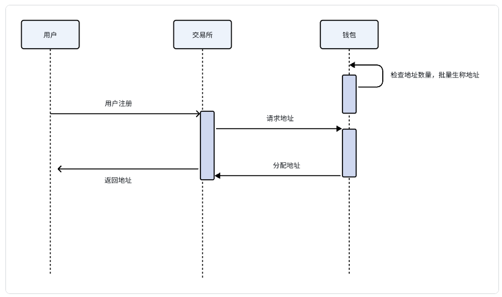
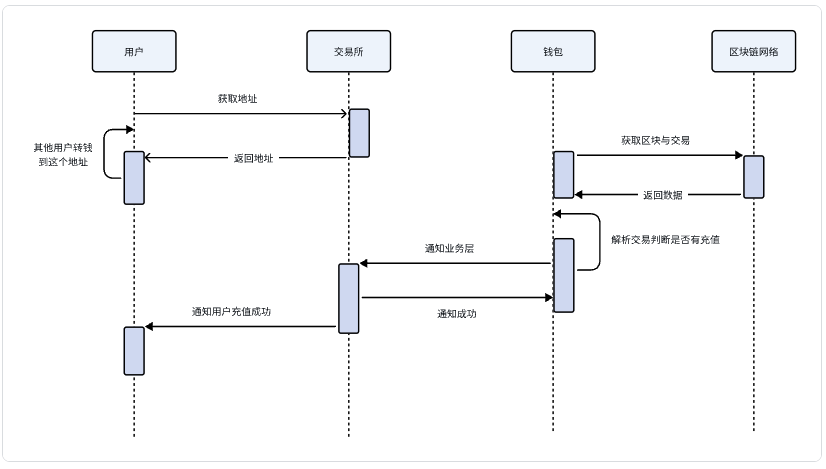
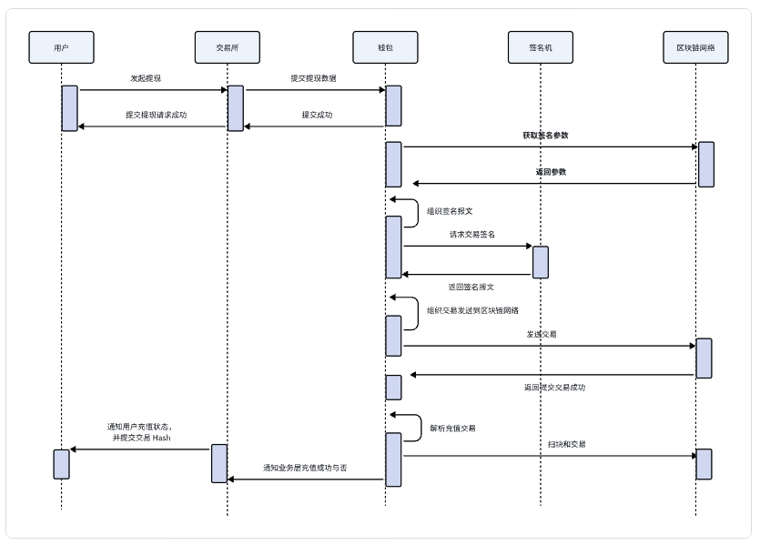
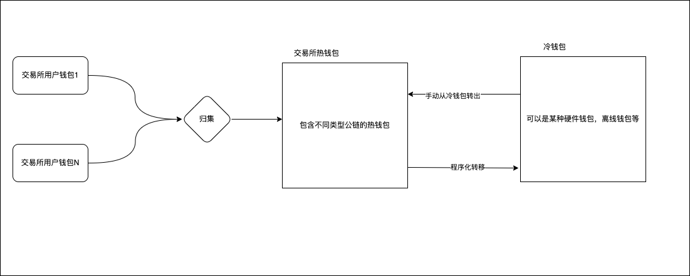

# 中心化钱包

常见业务：

- 批量地址生成
- 充值
- 提现
- 归集
- 热转冷
- 冷转热
- 交易回滚
- 链路风控
- 对账系统

## 批量地址生成

交易所钱包为了提高性能和快速响应，通常会预先生成大量地址存放在地址池中。当用户注册时，直接从地址池分配地址，而不是实时生成。地址池中的地址数量如果少于某个阈值，则会批量生成新的地址补充。

## 充值

充值过程是通过扫链服务来监控区块链上的交易数据，当检测到交易中的 `to` 地址是系统中某用户的地址时，即可判断有用户进行充值。这个过程中，除了钱包的扫链服务，还需要与风控系统配合，只有当风控系统和钱包服务都确认该笔交易有效时，才会通知业务层处理。在解析交易数据时，需要警惕恶意构造的交易攻击，因为某些区块链上可以进行这种操作。

## 提现

客户端用户输入提现信息（地址、金额、链）后，这些数据会被提交到交易所的业务层。业务层将数据发送给钱包，并建立用于风控验证的签名参数。钱包在收到数据后，首先进行风控验证，确认没有问题后，从链上获取签名参数并组织交易。然后生成待签名的交易报文，并将其交给签名机。签名机对交易报文进行签名后，将签名后的报文返回给钱包服务。钱包服务将交易组织完整后发送到区块链网络。交易发送成功后，扫链服务会监控到这笔交易，进行风控验证，通过后通知业务层提现成功，并上报交易哈希等信息。

## 归集

将资金转移到交易所管理的热钱包地址中。

## 热转冷

将热钱包中多余的资金转移到冷钱包中。

## 冷转热

从冷钱包将资金转到热钱包，手动操作的过程

