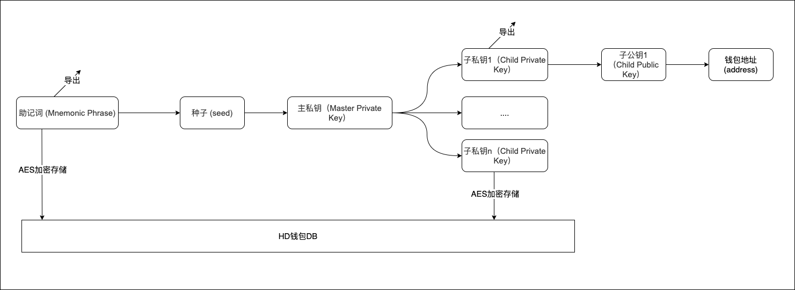
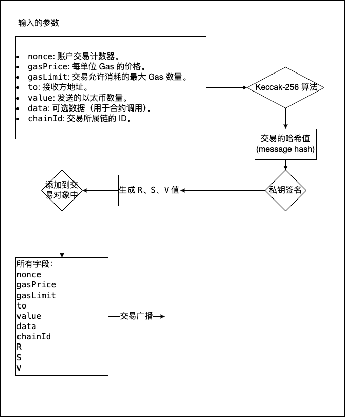

# 03. 去中心化钱包

## 名词说明

* 去中心化钱包

  去中心化钱包是一种让用户完全掌控自己加密资产的数字钱包，不依赖于第三方机构管理。它的特点是：

  * **自主性**: 用户自己生成并管理私钥，完全掌握对加密资产的控制权。
  * **无托管**: 私钥和助记词只存储在用户设备上，不会上传到任何服务器。
  * **隐私性**: 用户可以匿名使用，不需要提供个人身份信息。

  去中心化钱包通常通过助记词、私钥等信息生成和管理地址，常见的去中心化钱包包括 MetaMask、Trust Wallet 和 MyEtherWallet 等。

* 助记词

  助记词是一组简单易记的单词序列，用于帮助用户备份和恢复去中心化钱包。它的主要特点是：

  - **作用**: 助记词是由一系列人类可读的单词组成，用于生成主私钥（和后续的子私钥、地址等）。常见的助记词长度为 12 或 24 个单词。
  - **标准**: 助记词通常遵循 BIP-39 标准，从一个 2048 个单词的词库中随机选择。这些单词通过哈希算法生成主私钥。
  - **重要性**: 助记词相当于整个钱包的“钥匙”。一旦助记词泄露，任何人都可以恢复并访问钱包中的所有资产。

* 主私钥

  主私钥是由助记词生成的根私钥，代表了用户钱包的核心密钥。它的主要特点是

  * **作用**: 主私钥是整个密钥链的起点，通过特定的算法可以派生出子私钥、公钥和地址。
  * **派生路径**: 通过符合 BIP-32 或 BIP-44 标准的路径规则，可以从主私钥派生出多个子私钥。
  * **安全性**: 主私钥和助记词一样重要，任何人如果获取主私钥，都可以派生出所有关联的子私钥和地址。

* 子私钥

  ​	子私钥是从主私钥派生出来的次级私钥，用于管理特定的地址或资产。它的特点是：

  * **作用**: 子私钥通常用于生成单个地址及其对应的公钥，多个子私钥对应多个不同的地址。
  * **派生规则**: 使用主私钥和派生路径（如 `m/44'/60'/0'/0/0`）可以生成子私钥。不同路径对应不同的子私钥。
  * **可扩展性**: 通过主私钥可以生成无限多个子私钥，实现多账户管理。

* 公钥

  公钥是从私钥中生成的，用于在区块链上验证用户身份的密钥。它的特点是：

  * **作用**: 公钥用于加密信息或验证签名。它与私钥成对出现，但不能从公钥反向推导出私钥。
  * **生成**: 公钥可以从主私钥或子私钥通过椭圆曲线算法（例如 secp256k1）生成。
  * **公开性**: 公钥是公开信息，可以安全地分享给任何人，以便他们加密信息或发送加密货币。

* 地址

  地址是从公钥中推导出的用户在区块链上的身份标识，用于接收加密资产。它的特点是：

  * **作用**: 地址用于接收和发送加密货币，是区块链上的唯一标识符。
  * **生成**: 地址是通过哈希函数（如 Keccak-256 或 SHA-256）对公钥进行哈希计算得到的。例如，以太坊地址是公钥的 Keccak-256 哈希值的最后 20 个字节。
  * **格式**: 不同区块链有不同的地址格式（如比特币以 `1` 或 `3` 开头，以太坊以 `0x` 开头）。
  * **安全性**: 地址不包含任何私钥信息，可以安全地公开。

## HD钱包生成流程



以上为HD钱包初次创建时主要发生的流程。助记词的生成前课程有仔细讲解请看[HD钱包助记词生成原理及校验工作](https://www.youtube.com/watch?v=bMdiXi1W8Zg&list=PLdQ33vAo9pkuoH7CXfjvdP4g-NJ_PRIwp&index=2)。注意以上过程都是按箭头方向单向工作，不能逆向推导。往往在HD钱包中我们会存储可以导出的助记词和私钥。

在主私钥到子私钥推导过程中需要使用到BIP44协议标准

### BIP44

[主要公链bip44对照码](https://github.com/satoshilabs/slips/blob/master/slip-0044.md)

BIP44（Bitcoin Improvement Proposal 44）是一种用于管理和生成分层确定性（HD）钱包的标准。它在比特币和其他加密货币中广泛应用，提供了一种灵活、安全的方式来生成和管理大量的地址。以下是BIP44协议的主要内容和特点：

1. 分层确定性（HD）钱包：
   - HD钱包使用一个种子（seed）来生成整个钱包的所有密钥对。这个种子可以通过助记词（mnemonic phrase）表示和备份。
   - BIP44建立在BIP32的基础上，BIP32定义了HD钱包的基本框架。
2. 路径结构：
   - BIP44定义了一种五级路径结构，用于分层管理钱包的不同部分。路径格式为：`m / purpose' / coin_type' / account' / change / address_index`。
   - 每一级路径的具体含义如下：
     - **Purpose**：恒为`44'`，表示这是一个遵循BIP44标准的钱包。
     - **Coin Type**：指定使用的加密货币类型。例如，比特币是`0'`，以太坊是`60'`。
     - **Account**：用于区分不同的账户，可以让用户在一个钱包中管理多个账户。
     - **Change**：`0`表示外部地址，用于接收付款；`1`表示内部地址，用于接收找零。
     - **Address Index**：用于生成具体的地址，从`0`开始递增。

假设你有一个比特币HD钱包，其中一个具体地址的路径可能是： m / 44' / 0' / 0' / 0 / 0，表示第一个账户的第一个外部地址。

## HD钱包导入助记词流程

助记词导入后和上诉HD钱包生成流程类似。

## 转账操作(ETH为例)

### 余额的获取

钱包离线：从本地数据库取出对应账户的balance

钱包在线：请求rpc获得余额，并更新到本地数据库中

### 两种转账操作

#### 普通转账交易（Legacy Transaction）

这是最初的、传统的以太坊交易格式。Legacy 交易使用 `gasPrice` 来指定每单位 gas 的费用，结构相对简单。

```json
{
  "nonce": 0, // 交易发起者（通常是发送方账户地址）的交易计数器。每笔交易都必须有唯一的 nonce 值，通常是从 0 开始并递增。它用于防止交易重放攻击。
  "gasPrice": "20000000000", // 交易支付的每单位 gas 的价格（以 wei 为单位）。表示愿意为每单位 gas 支付的费用。设置太低可能导致交易无法被矿工打包。
  "gasLimit": 21000, // 交易执行的最大 gas 数量限制。用于限制交易在执行时所能消耗的最大 gas 量。如果交易消耗的 gas 超出这个限制，将会失败。
  "to": "0xRecipientAddress", // 接收方的地址。如果是合约部署交易，此字段可以为空（或省略），否则是一个有效的以太坊地址。
  "value": "1000000000000000000",// 发送的以太币数量（以 wei 为单位）。可以为 0 表示仅调用合约函数或发送代币。
  "data": "0x", //  可选字段，表示要发送的交易数据。对于合约调用，这通常是编码后的合约方法和参数。对于普通转账交易，此字段可以为空或省略。
  "chainId": 1 // 所属链的链 ID。用于交易签名和验证。主网的 chainId 是 1，测试网及其他网络有各自不同的 ID 值。
}
```

#### EIP-1559 交易（EIP-1559 Transaction)

EIP-1559 交易引入了 `maxPriorityFeePerGas`（矿工小费）和 `maxFeePerGas`（总费用上限）来代替传统的 `gasPrice`。此外，这种交易类型可以动态调整基本费用 `baseFee`，以更好地应对以太坊网络的拥堵情况。

```json
{
  "nonce": 0,
  "maxPriorityFeePerGas": "2000000000", // EIP-1559 交易中包含的最大优先费用（小费），给矿工的奖励，单位是 wei。
  "maxFeePerGas": "30000000000", // EIP-1559 交易中包含的最大总费用（maxPriorityFeePerGas + baseFee），单位是 wei。
  "gasLimit": 21000,
  "to": "0xRecipientAddress",
  "value": "1000000000000000000",
  "data": "0x",
  "chainId": 1,
  "type": 2 //  交易类型。EIP-1559 引入了不同的交易类型（例如类型 0 为传统交易，类型 2 为 EIP-1559 交易）。
}
```

### 交易构建流程



1. **交易构建（Transaction Construction）**
   - **输入参数：**
     - `nonce`: 账户交易计数器。
     - `gasPrice`: 每单位 Gas 的价格。
     - `gasLimit`: 交易允许消耗的最大 Gas 数量。
     - `to`: 接收方地址。
     - `value`: 发送的以太币数量。
     - `data`: 可选数据（用于合约调用）。
     - `chainId`: 交易所属链的 ID。

2. **生成交易哈希（Hash Generation）**
   - 将以上字段通过 RLP 编码后，使用 Keccak-256 算法生成交易的哈希值（message hash）。

3. **交易签名（Transaction Signing）**
   - 使用发送者的私钥对交易哈希进行签名，生成 `R`、`S`、`V` 值：
     - `R` 和 `S`：签名的两个参数。
     - `V`：用来恢复公钥的签名恢复参数（包含链 ID 信息）。
   - 将 `R`、`S`、`V` 值添加到交易对象中。

4. **交易序列化（Transaction Serialization）**
   - 将所有字段（`nonce`、`gasPrice`、`gasLimit`、`to`、`value`、`data`、`chainId`、`R`、`S`、`V`）组合成序列化的交易对象（Tx）。↓

5. **交易广播（Transaction Broadcasting）**
   - 通过 `eth_sendRawTransaction` 方法将序列化的交易发送到以太坊网络。
   - 交易被节点接收并验证后，加入交易池。

6. **网络传播与确认（Network Propagation and Confirmation）**
   - 交易被传播到全网其他节点。
   - 矿工从交易池中选择交易，将其打包进新区块中。
   - 区块被打包并确认，交易被永久记录在区块链上。

通过这个流程图的描述，可以清晰地看到每个步骤是如何衔接的，如何确保交易的完整性和安全性。

## ETH上交易类型

**普通转账交易**: 需要 `nonce`、`gasPrice`、`gasLimit`、`to`、`value` 这几个参数。

**合约调用交易**: 除了 `nonce`、`gasPrice`、`gasLimit`、`to`、`value` 外，还需要 `data` 参数，其中 `data` 是编码后的合约方法及其参数。

**合约部署交易**: 需要 `nonce`、`gasPrice`、`gasLimit`、`data`（合约字节码），`to` 字段可以为空。

**EIP-1559 交易**: 使用 `maxPriorityFeePerGas` 和 `maxFeePerGas` 来替代 `gasPrice`。`type` 设置为 2（表示 EIP-1559 交易）。


