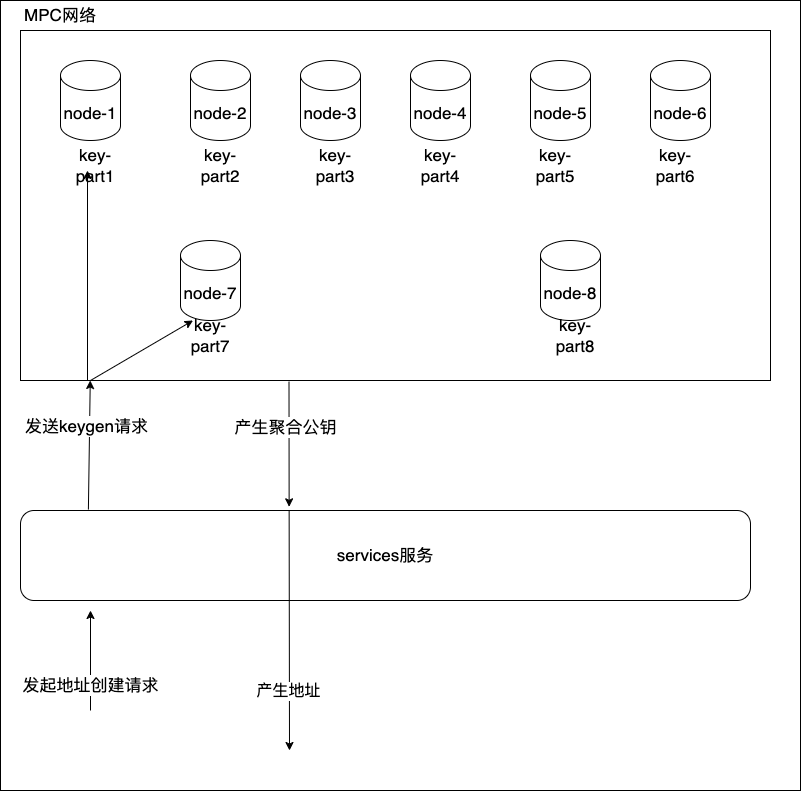
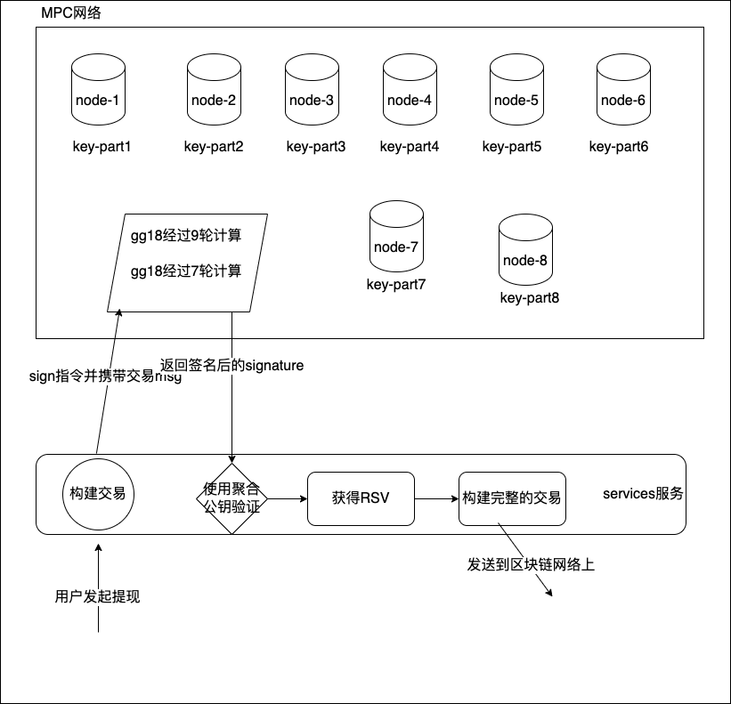

# 04.MPC托管钱包原理

MPC（Multi-Party Computation，多方计算）托管系统是一种基于密码学的安全技术，用于管理和保护加密货币等数字资产的私钥。它通过多方计算协议来分散对私钥的控制权，避免单点故障和集中式托管的安全隐患。

MPC和一般的中心化交易所功能区别主要在于：私钥生成流程和签名过程不同。

## 地址生成过程

### 名词解释

**MPC网络**：

- **Node (节点)**：每个节点负责生成和保存一个密钥片段（key-part），图中有8个节点（node-1到node-8），每个节点保存的密钥片段分别为 `key-part1` 到 `key-part8`。这些密钥片段共同组成了一个完整的密钥，但任何单个节点都无法掌握完整密钥。

**Key-part（密钥片段）**：

- 代表密钥的一个分片（fragment），由各个节点独立生成和存储。只有各个节点合作，才能够恢复完整的密钥，用于签名或生成地址。

**Services 服务**：

- 这是一个中心化的服务模块，用于接收用户请求，并协调MPC网络中的各个节点完成密钥生成和地址创建等操作。

**Keygen 请求**：

- 这是发起密钥生成请求的操作，启动了各个节点之间的多方计算协议，使得所有节点生成各自的密钥片段并共享相关信息，以生成一个安全的、公平的聚合公钥。

### 地址生成流程简述

1. **发送地址创建请求（用户 → Services 服务）**：
   - 用户向 `Services` 服务发送创建地址的请求。这个请求表示用户希望生成一个新的地址，该地址将由MPC网络的节点联合管理。
2. **发送 Keygen 请求（Services 服务 → MPC 网络）**：
   - `Services` 服务接收到用户请求后，向MPC网络中的所有节点发送 `Keygen` 请求。这个请求启动了多方密钥生成（MPC Key Generation）协议。
3. **节点生成密钥片段（MPC 网络）**：
   - 每个节点（node-1 到 node-8）生成一个密钥片段 `key-part`。这些密钥片段是独立的随机数，每个节点只能掌握自己生成的 `key-part`。
   - 节点之间通过安全的通信协议（通常是加密的）互相交换必要的信息，用于验证和计算。
4. **生成聚合公钥（MPC 网络 → Services 服务）**：
   - 所有节点将它们的密钥片段信息组合，使用多方计算协议（MPC协议）生成一个聚合公钥（Aggregate Public Key）。
   - 这个聚合公钥被返回给 `Services` 服务，用于生成用户请求的地址。
5. **生成地址（Services 服务）**：
   - `Services` 服务使用从MPC网络中获得的聚合公钥生成用户的区块链地址。这个地址是一个唯一的、公认的地址，可以在区块链上使用。
6. **返回地址（Services 服务 → 用户）**：
   - `Services` 服务将生成的区块链地址返回给用户。用户可以将这个地址用于收发资产、签名交易等操作。

## 签名过程

上图展示了 MPC（多方计算）网络中签名操作的流程。我们来逐步解析和简述各个步骤。

### 签名流程解析

1. **用户发起提现请求（用户 → services 服务）**：
   - 用户在图中发起提现请求，这个请求包含了交易信息，例如接收地址、金额等细节。`services` 服务接收到这个请求后，需要对该交易进行签名以验证其合法性和安全性。

2. **构建交易（services 服务）**：
   - `services` 服务根据用户请求的信息构建一个交易结构。这包括将交易的各个字段（如发送方、接收方、金额等）组合成待签名的消息 `msg`。

3. **签名指令带携交易 msg（services 服务 → MPC 网络）**：
   - `services` 服务将待签名的交易消息 `msg` 及签名指令发送到 MPC 网络，要求各个节点共同完成对交易的签名。

4. **MPC 网络中各个节点的签名操作（MPC 网络）**：
   - **节点签名计算（gg18 协议）**：
     - 各个节点（node-1 到 node-8）持有密钥片段 `key-part`。它们通过多方计算协议（图中提到的 `gg18` 协议）对消息 `msg` 进行协同签名。
     - `gg18` 协议是一个多方ECDSA签名协议，通常经过多轮计算（图中标注了9轮和7轮计算）来完成签名。每轮计算中，各个节点会交换必要的信息，逐步生成ECDSA签名的 `r`、`s`、`v` 值（统称为RSV）。
     - 计算过程确保没有任何单个节点能够获得完整的私钥信息，只能通过合作来生成签名。

5. **返回签名后的 signature（MPC 网络 → services 服务）**：
   - MPC 网络中的节点完成 `gg18` 协议后，会返回最终生成的签名 `signature` 给 `services` 服务。该签名是对交易消息 `msg` 的数字签名。

6. **使用聚合公钥验证签名（services 服务）**：
   - `services` 服务使用 MPC 网络生成的聚合公钥对签名进行验证，确保签名的合法性和完整性。

7. **获得 RSV**：
   - 交易签名的结果由 `r`、`s`、`v` 三个值组成，简称 RSV。这是 ECDSA 签名的标准格式，包含了完整的签名信息。

8. **构建完整的交易（services 服务）**：
   - `services` 服务将生成的 `RSV` 值填入到交易结构中，构建一个完整的交易。

9. **发送到区块链网络上（services 服务 → 区块链网络）**：
   - 构建完成的交易被 `services` 服务广播到区块链网络上。区块链节点将对该交易进行验证和打包入块。

10. **交易构建完成**：
    - 交易被成功广播到区块链网络，整个签名和广播流程完成。

### 重要名词解释

1. **gg18 协议**：
   - gg18 是指 `Gennaro and Goldfeder` 在2018年提出的一种安全、高效的多方ECDSA签名协议。它允许多个方（节点）在没有任何单个方持有完整私钥的情况下完成签名。该协议通过多轮交互来确保签名的安全性。
   - 图中提到的“9轮”和“7轮”计算分别指代gg18协议中不同步骤的执行轮次，具体取决于签名参与方的数量和协议的具体实现。

2. **RSV**：
   - 这是ECDSA签名的三个组成部分：
     - `R`：签名的椭圆曲线点的横坐标。
     - `S`：签名的哈希值。
     - `V`：恢复标志，用于恢复公钥。

3. **聚合公钥（Aggregate Public Key）**：
   - 这是MPC网络中所有节点的密钥片段共同生成的一个公钥，代表整个密钥管理系统的身份。它用于验证签名的合法性。

4. **签名指令**：
   - 向MPC网络发出的请求，要求使用存储在各个节点上的密钥片段对交易进行签名。

