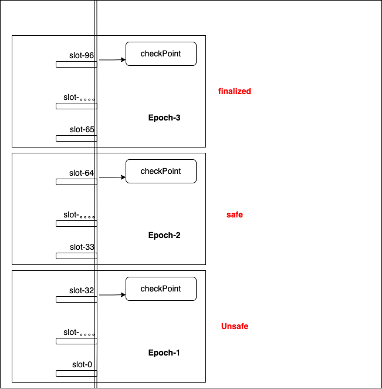

# 05.ETH确认位

## 名词解释

* block： 是以太坊区块链的基本数据结构，包含交易记录和状态信息。
* Slot：Slot 是 epoch 中的一个时间单位，网络中的每个 slot 可以生成一个区块（虽然不一定每个 slot 都会有区块生成）。一个epocho包含了32个slot，每个slot中包含一个区块或为空。在以太坊 2.0 中，每个 slot 的时间长度为 12 秒。
* Epoch（纪元）： 是以太坊 2.0 中的一个时间周期，用于组织区块生成和验证工作。在以太坊 2.0 中，epoch 的时间长度为 32 个 slots，每个 slot 的时间长度为 12 秒。所以，一个 epoch 大约持续 6 分钟。

总之：

* **`Epoch`** 是时间的一个大单位，用于组织 `slots` 和 `blocks`。
* **`Slot`** 是一个小的时间单位，期间可能会生成一个 `block`。
* **`Block`** 是包含交易数据的实际数据结构，在 `slot` 中生成。

## 确认位问题

Checkpoint 是在每个 epoch 结束时确定的一个状态快照。对Epoch状态的一种确认。

### 三种状态

* Unsafe：状态指的是区块链中的状态可能会发生变化，之前的区块或交易可能会被回滚或更改。这个状态下的区块和交易尚未得到充分的确认，可能会因网络中的分叉而发生变化。特点为：不安全状态的区块可能会被新的区块替代，网络可能对这些区块进行重组或调整。在 unsafe 状态下，区块链还处于一个动态的、不断变化的阶段。
* Safe：状态指的是区块链中的状态已经有一定的稳定性，但仍可能会发生更改。这个状态下的区块是相对安全的，但仍有可能因网络分叉而发生变化。特点为：safe 状态的区块是经过了初步的确认，网络中的多数节点已经接受了这些区块。在 safe 状态下，区块和交易通常会被确认并成为未来区块链历史的一部分，但仍有可能受到进一步的网络调整。
* Finalized： 状态指的是区块链中的状态已经完全确定，不会再被更改或回滚。这个状态的区块是不可逆的。特点：一旦区块被标记为 finalized，它就不会再被修改或删除。finalized 状态的区块是以太坊区块链的最终历史记录的一部分。

总之：

- **`unsafe`** 状态下的区块可能会因为网络分叉而被替代。
- **`safe`** 状态下的区块经过了一些确认，但尚未成为最终历史。
- **`finalized`** 状态下的区块是最终确认的状态，不能再被更改。

## 中心化交易所确认位作用

在unsafe中的交易可能被回滚，对应转账记录失效。用户在unsafe的块儿状态，将资产买卖成其他资产是不安全可靠的。当使用64个块儿作为确认位，可以有效避免回滚的操作。这个是参考值，不同交易所选择不同的数量作为确认位。

## 重组和回滚

区块链中的**重组（reorganization）**和**回滚（rollback）**是两个相关但不同的概念，它们都涉及链上数据的变化，但发生的原因和影响各不相同。以下是它们的定义和区别：

### 1. 区块链重组（Reorganization, Reorg）

**重组**指的是在区块链中，出现了一条新的链（fork）比现有链更长，导致节点放弃当前链的一些区块并切换到更长的链上。这个过程发生在去中心化网络中，特别是在以下情况下：
- 矿工（或验证者）在相近的时间点生成了多个区块。
- 某个矿工在主链的某一区块后找到了一个新链，并持续挖掘，最终形成了一条更长的链。

**重组的过程**：
- 当网络检测到一条比当前主链更长的链，节点会丢弃当前链中从某一区块之后的区块，转而采用新的、更长的链。
- 之前已经确认的区块和交易可能会被取消，这些被丢弃的区块称为**孤块**（orphaned blocks）。

**重组的影响**：
- 重组通常会导致部分交易被回滚，因为新链上的交易与原链不同。被回滚的交易会重新回到交易池，等待重新打包。
- 一般来说，重组发生在几块区块的范围内，通常是 2-3 个区块的长度。
- 重组是区块链的正常现象，但频繁或大规模的重组可能会引发安全和信任问题。

### 2. 区块链回滚（Rollback）

**回滚**指的是区块链网络在发现严重问题（如双重花费攻击、共识机制故障、或者软件 bug）后，主动地放弃已经确认的区块，并回滚到之前的某个状态。回滚往往是人为决策，通常在以下情况下发生：
- 发现了重大安全漏洞或攻击，例如 51% 攻击。
- 软件 bug 导致错误交易被确认。
- 社区或者开发者认为需要回到特定的链上状态。

**回滚的过程**：
- 节点手动或通过升级决定丢弃现有的部分区块，并恢复到之前某个已经达成共识的状态。
- 交易和区块的状态会被重置，某些交易可能会被取消，而在旧链上的资产状态可能需要重新确认。

**回滚的影响**：
- 回滚通常比重组涉及的范围更广，甚至可能包括多个区块链应用、智能合约和用户资产。
- 回滚通常是网络最后的应急措施，可能带来较大的信任问题，因为它打破了区块链“不可逆”的属性。
- 一个典型的例子是 2016 年以太坊的 DAO 事件，以太坊社区通过硬分叉的方式进行了回滚，导致以太坊（ETH）和以太坊经典（ETC）分裂。

### 总结：重组与回滚的区别

| 项目     | 重组（Reorganization）               | 回滚（Rollback）                             |
| -------- | ------------------------------------ | -------------------------------------------- |
| 发生原因 | 自然竞争导致的链分叉，新链比旧链更长 | 重大故障、攻击或社区决策导致的状态重置       |
| 主导力量 | 自动发生，由共识机制决定             | 人为决策，通常是由开发者或社区发起           |
| 涉及范围 | 一般为较短链段（2-3个区块）          | 可能是大规模的区块回退，甚至硬分叉           |
| 交易影响 | 被重组的交易可以回到交易池重新打包   | 被回滚的交易被丢弃，资产状态可能需要重新确认 |
| 常见程度 | 常见，尤其在 PoW 链中                | 非常罕见，通常是极端事件后的应对措施         |

重组是区块链正常运作的一部分，而回滚是紧急情况下的特殊措施。

## 交易执行过程

以太坊交易的执行过程可以分为以下几个关键步骤：

**1. 构建交易**

用户构建交易，交易中包含以下关键信息：
- `nonce`：发送者账户的交易计数，用于防止双重花费和排序交易。
- `gas price`：发送者愿意为每单位 gas 支付的价格。
- `gas limit`：该交易允许消耗的最大 gas 数量。
- `to`：接收者地址（对于智能合约部署交易，这一字段为空）。
- `value`：发送的 ETH 数量（可为 0，尤其在调用智能合约时）。
- `data`：调用智能合约或执行特定功能时的附加数据。
- `chainId`：以太坊链的 ID，防止跨链重放攻击。

**2. 生成带签名的交易**

交易数据构建好后，使用发送者的私钥对交易进行签名，生成包含签名信息的交易消息。该过程通常涉及对交易的哈希值（message hash）进行椭圆曲线数字签名 (ECDSA)，并生成 `v`, `r`, `s` 签名值。

**3. 广播交易**

带签名的交易通过节点被广播到以太坊网络。每个节点会将收到的交易放入 **交易池（mempool）** 中，等待被打包到区块中。

**4. 交易校验**

在交易进入区块之前，会进行一系列的校验：
- **nonce 检查**：确保发送者的 `nonce` 和账户状态中的计数匹配。
- **签名验证**：通过 `v`, `r`, `s` 签名值验证交易确实由私钥持有者发起。
- **余额检查**：确认发送者账户的余额足够支付 `value` 和 `gas` 费用。

**5. 矿工从交易池中选择交易并执行**

矿工节点会从 **mempool** 中提取交易并按照 gas price 的高低进行优先排序，选择高 gas 费的交易优先打包。

**6. EVM 执行交易**

在将交易打包到区块之前，以太坊虚拟机（EVM）会对每笔交易进行执行：
- **EVM opcode 执行**：如果是合约调用或合约部署交易，EVM 会执行交易中 `data` 字段中包含的字节码操作码，依次完成调用逻辑。
- **Gas 费用结算**：EVM 会根据每一步操作消耗的 gas 来扣除费用，并记录执行过程中实际消耗的 gas 数量。

**7. 交易打包进区块**

交易执行完成后，矿工将交易打包进新区块，交易的最终状态（包括成功或失败）会记录在区块中。

**8. 出块和共识**

矿工创建新区块后，通过 **工作量证明（PoW）** 或 **权益证明（PoS）** 提交该区块，并等待其他节点验证：
- 在 PoS 系统中，验证者节点对区块进行 **投票**，以达成共识。
- 区块会经历从 **unsafe**（未确认）到 **safe**（安全）再到 **finalized**（最终确认）的过程。最终确认后，区块不会被回滚，交易状态也不可逆转。

**9. 确认**

- 一旦交易被包含在一个被网络接受的区块中，交易被视为已确认。
- 在 PoS 机制下，随着后续区块的生成，确认交易的安全性越来越高。
  

经过多个区块确认后，交易会变得“最终不可逆”，即达到 **finalized** 状态。

