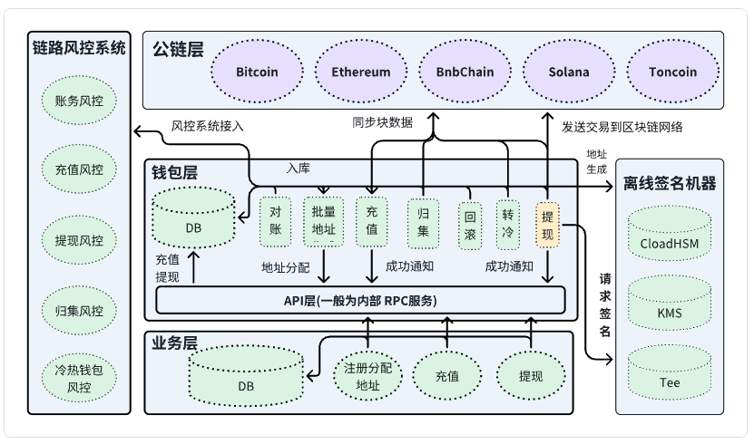

# ETH中心化交易所钱包实现 

## 主要功能
开发一个ETH中心化钱包，实现的业务功能：
* 批量地址生成
* 充值
* 提现
* 归集
* 转冷
* 冷转热

本系统需要和风控，交易所业务部门进行等业务方进行合作。

## 名词解释
* 充值
* 提现
* 归集
* 转冷
* 冷转热
* RPC内部通信
* 公钥
* 私钥

## 系统架构设计

## 功能模块
### 充值提现流程
### 和其他业务如何对接
 
## 技术选择原因
### 通信协议选择
* 内部rpc
* 对外接口：
### 数据库
### 编程语言
* 签名机(node.js)
* 扫链(golang)

## 涉及的业务方
### 与现货
* 充值到账通知
* 提现成功通知 
* 批量地址获取
* 提现交易提交

### 风险控制
* 签名验证
* 交易验证

## 数据结构

## 业务执行

